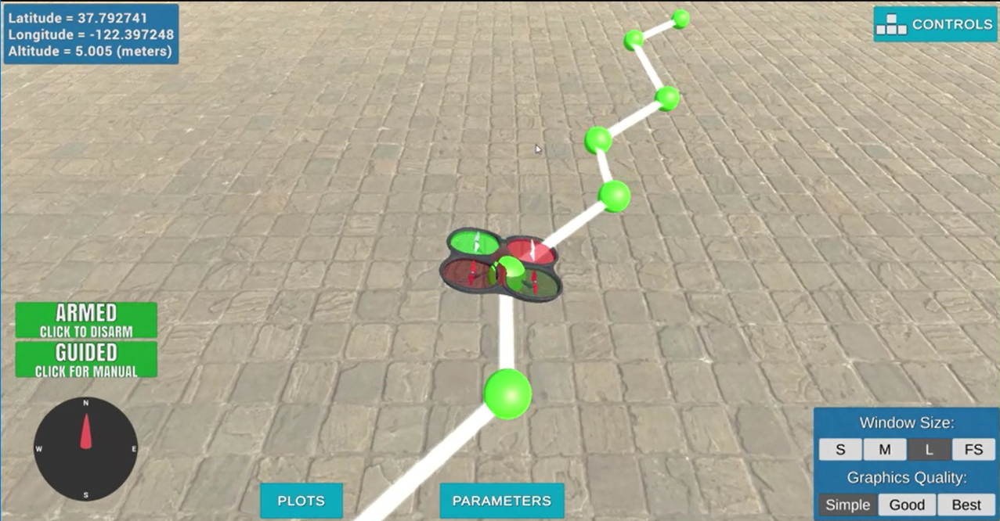

## Project: 3D Motion Planning

---

# Required Steps for a Passing Submission:

1. Load the 2.5D map in the colliders.csv file describing the environment.
2. Discretize the environment into a grid or graph representation.
3. Define the start and goal locations.
4. Perform a search using A\* or other search algorithm.
5. Use a collinearity test or ray tracing method (like Bresenham) to remove unnecessary waypoints.
6. Return waypoints in local ECEF coordinates (format for `self.all_waypoints`) is [N, E, altitude, heading], where the drone’s start location corresponds to [0, 0, 0, 0].
7. Write it up.
8. Congratulations! Your Done!

## [Rubric](https://review.udacity.com/#!/rubrics/1534/view) Points

### Here I will consider the rubric points individually and describe how I addressed each point in my implementation.

---

### My Solution Writeup / README

#### 1. Provide a Writeup / README that includes all the rubric points and how you addressed each one. You can submit your writeup as markdown or pdf.

See below for my solution writeup

### Explain the Starter Code

#### 1. Explain the functionality of what's provided in `motion_planning.py` and `planning_utils.py`

The `motion_planning.py` program is an extension of `backyard_flyer_solution.py` which is a basic program that flies the drone in a square shape. Building on that functionality, the `motion_planning.py` program includes an additional state called "PLANNING" which begins once the `plan_path()` method is called in the `state_callback()` method and is responsible for planning the drone's path before takeoff from start to goal while avoiding any obstacles. Additionally, the `planning_utils.py` program is responsible for all the utility functions that are actually responsible for planning the path. 

The `plan_path()` method first sets a few attributes that specify the target altitude and the safety_distance that the drone needs to maintain while it is navigating obstacles. After that, `plan_path()` reads in the obstacle data and defines a grid that serves as the state space for the plan. Specifically, `path_plan()` calls on the `create_grid()` method from the `planning_utils.py` which is responsible for returning the grid that will be used for the `a_star()` planning algorithm. The grid is determined by calculating the offset values for where the real world coordinates would fall on the grid. This transformation ensures that the real world geodetic coordinates of the drone can be mapped to grid space and input to the A* path planning algorithm.  

After the grid is defined, the `a_star()` algorithm is called in the `plan_path()` method which accepts the following inputs: the grid data, the heuristic function, and the start and goal positions on the grid. `a_star()` searches the grid space by visiting each node and uses a total cost function called `f(n)` (or queue_cost in the `a_star()` implementation) to calculate the total cost of exploring each node. `f(n)` calculates the total cost which is a sum of the heuristic `h(n)` (i.e. how costly it is to move from the next_node to the goal position), and `g(n)` which is the cost to reach the current node from the start node. This implementation of `a_star()` uses Euclidean distance between the next node and the goal position as the heuristic `h(n)`. At each step, the `a_star()` algorithm will iterate over all the possible actions and determine what the next node is based on the available actions from `valid_actions()` and what the total cost of moving to that node would be. It stores all that information in the `branch` dictionary and inputs it to the queue. Since the queue is a `Priority Queue`, it will dynamically manage each node by ensuring that the lowest cost nodes are always stored at the top, effectively ensuring that the best possible move is next.  After the path is calculated and a path is found, the `a_star()` function retraces it's steps from the goal to the start and creates the list of points that the drone will travel. If it cannot find a path, it will print that it failed to find a path. 

### Implementing Your Path Planning Algorithm

#### 1. Set your global home position

Here students should read the first line of the csv file, extract lat0 and lon0 as floating point values and use the self.set_home_position() method to set global home. Explain briefly how you accomplished this in your code.

See lines 123-127 in `motion_planning.py`. I used the open() function to read in the first lien of colliders.csv values and did some string manipulation to input the latitude and longitude values into a list so I can easily access them. 

#### 2. Set your current local position

Here as long as you successfully determine your local position relative to global home you'll be all set. Explain briefly how you accomplished this in your code.

See lines 133-141 in `motion_planning.py`. I used the `set_home_position()` method to set my home position to the coordinates in the colliders.csv file that I retrieved in the previous step. 

After that, I retrieved my current global position using the _latitude, _longitude, and _altitude properties. 

Lastly, I used the `global_to_local()` function to get my local_position which translated the global geodetic coordinates to local real world coordinates. Then I could apply the offset in the next step to transform the coordinates to grid space. 

#### 3. Set grid start position from local position

This is another step in adding flexibility to the start location. As long as it works you're good to go!

See line 164 in `motion_planning()`. I determined the drone's start position by translating it's local_position to grid coordinates using the offset values.  

#### 4. Set grid goal position from geodetic coords

This step is to add flexibility to the desired goal location. Should be able to choose any (lat, lon) within the map and have it rendered to a goal location on the grid.

See lines 170-178 in `motion_planning()`. Allows you to choose arbitrary latitude, longitude, altitude values. Then the `global_to_local()` function again will translate the global geodetic coordinates to local coordinates. Lastly, the local coordinates are translated one more time to grid coordinates using the offset. 

#### 5. Modify A* to include diagonal motion (or replace A* altogether)

Minimal requirement here is to modify the code in planning_utils() to update the A\* implementation to include diagonal motions on the grid that have a cost of sqrt(2), but more creative solutions are welcome. Explain the code you used to accomplish this step.

See line 58-61 in `planning_utils()`. I achieved the minimal requirement of adding diagonal motions with a cost of sqrt(2). The diagonal motions just increment the the x, y values by +1 or -1 depending on the direction. Since A* iterates over each action already in `valid_actions()`, the new motions I added were introduced. 

#### 6. Cull waypoints

For this step you can use a collinearity test or ray tracing method like Bresenham. The idea is simply to prune your path of unnecessary waypoints. Explain the code you used to accomplish this step.

See lines 185, 191 - 225 in `planning_utils()`. I implemented a function called `prune_path()` that takes in the full path list and returns the pruned path based on the collinearity test. 

Within `prune_path()`, the function uses the pruned_path variable to store all the waypoints after pruning them using the collinearity test. It is initialized with the start node from the input path list. It them iterates over the path from the 2nd point to the 2nd to last point. On each iteration, it checks if the last point in pruned_path (i.e. the last valid point so far) is collinear with the current point in the path list and the next point in the path list. 
If they aren't collinear, then that current point in the path is added to the pruned_path list since it needs to be included in the final list of points (i.e. it cannot be pruned). If that current point is collinear with the other two, then the function skips over it and doesn't add it to the final list of points. The collinear test is implemented by taking in three points, converting each one to a numpy array and using the numpy matrix determinant method with a threshold of 10^-2 m to determine if points are collinear.   

### Execute the flight

  

#### 1. Does it work?

It works!

### Double check that you've met specifications for each of the [rubric](https://review.udacity.com/#!/rubrics/1534/view) points.

# Extra Challenges: Real World Planning

For an extra challenge, consider implementing some of the techniques described in the "Real World Planning" lesson. You could try implementing a vehicle model to take dynamic constraints into account, or implement a replanning method to invoke if you get off course or encounter unexpected obstacles.
